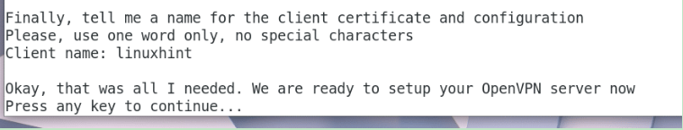

## 1.安装


Now OpenVPN should ask you which DNS service you want to use. Just pick any one of them and press <Enter>


Now OpenVPN should ask you for the encryption method it should use. I will leave the defaults. If you know what these are, you may use a different option. Once you’re done, press <Enter> to continue


Then OpenVPN should ask you for Diffie-Hellman key bits. I will leave the default 3072 bits. You may change it if you want. Once you’re done, press <Enter> to continue.


Now OpenVPN should ask you how many bits of RSA key you want to generate. I will leave the default 3072 bits. You may choose other options according to your need. Once you’re done, press <Enter> to continue


Now OpenVPN should ask you for a name as which it will save it’s client configuration file. This is the file you will be using to connect to the OpenVPN server. The default filename is ‘client’ and it generates ‘client.ovpn’ file. You can leave the default or change it if you want


Now press <Enter> to continue



Press ‘y’ and press <Enter> to continue. OpenVPN installer should update all the packages of your computer and install new packages if requires


## 2.client端启动

### linux启动

```shell
 openvpn --config linuxhint.ovpn
```

## 3.查看ip

https://www.whatsmyip.org/


